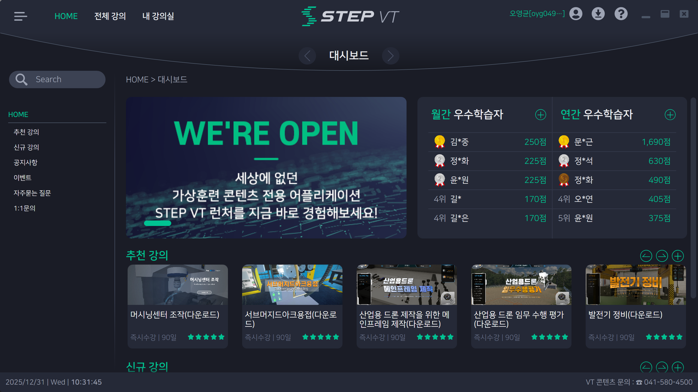
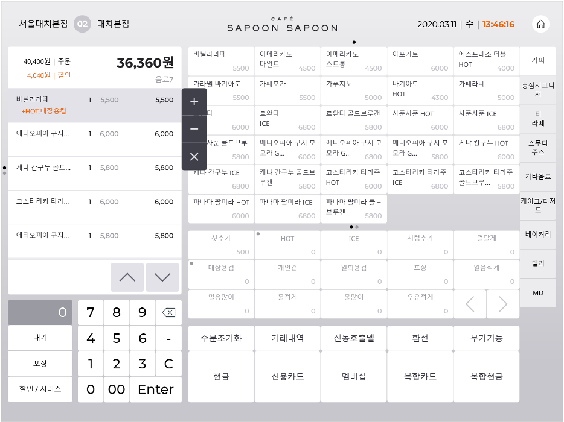
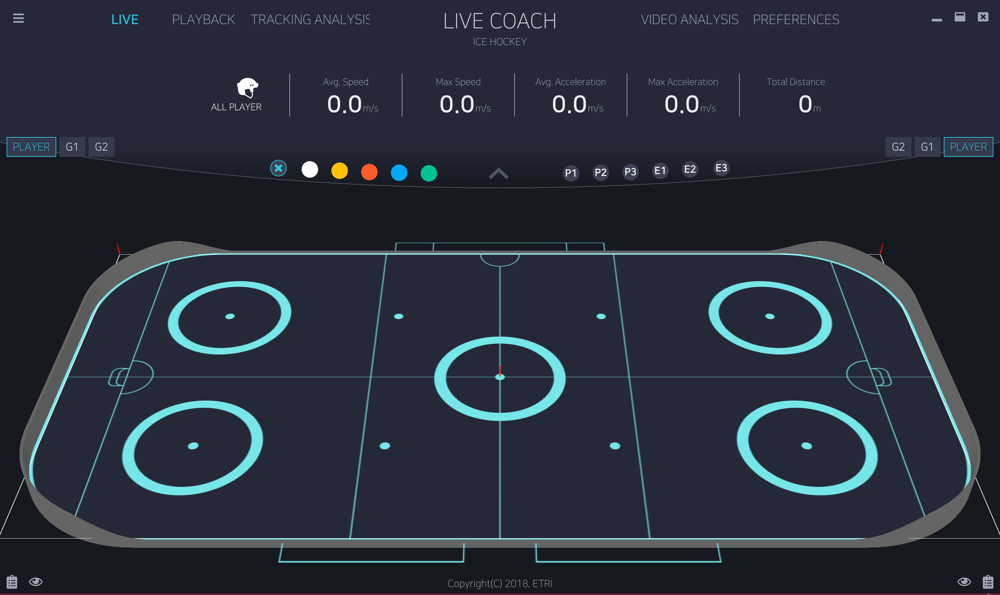
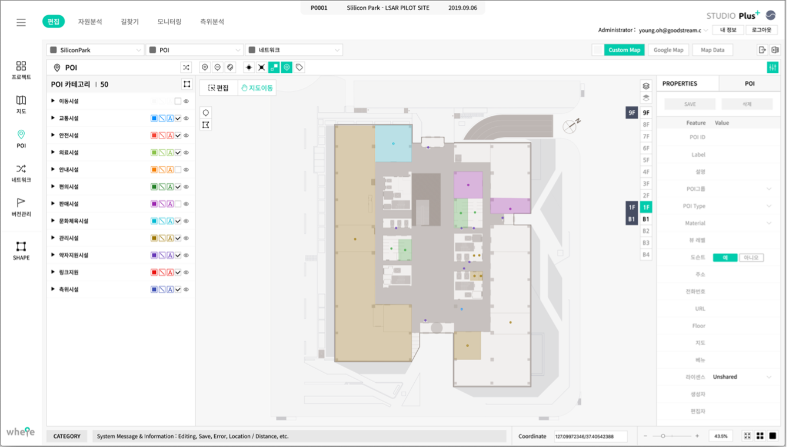
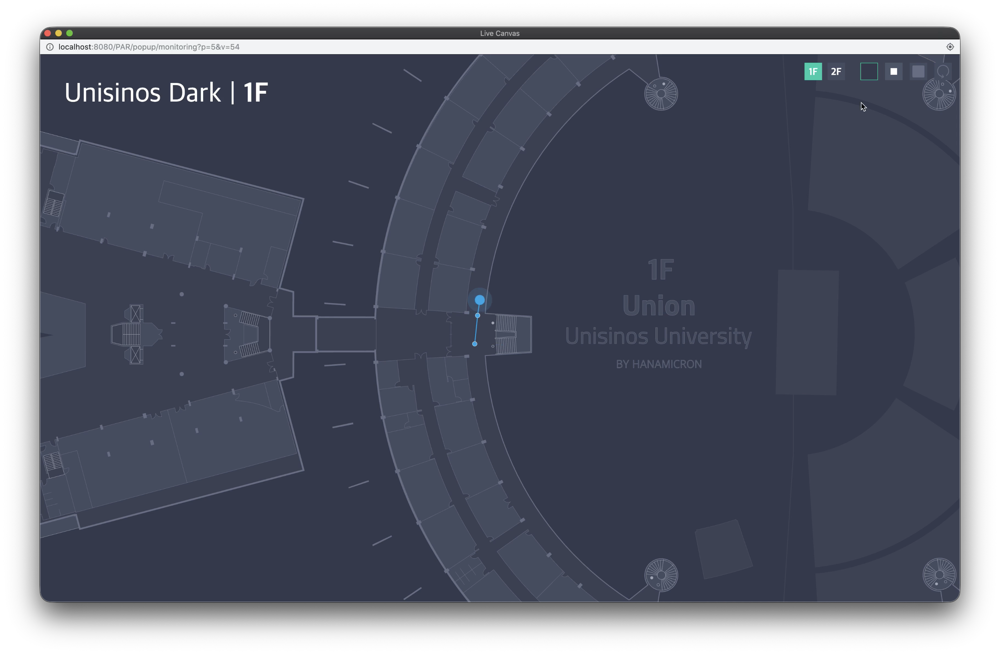
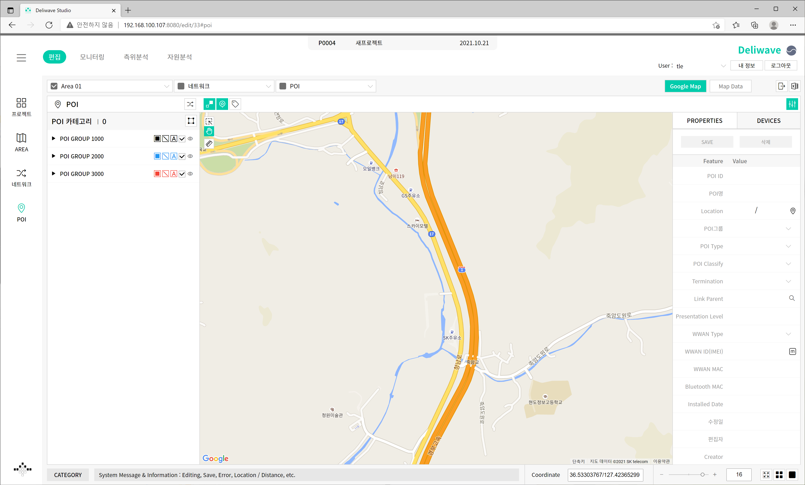

# Developer Portfolio

## Introduction
**.NET 기반의 데스크톱 애플리케이션 개발(WPF)**을 주력으로 하며, **웹 프론트엔드 개발** 역량을 겸비한 소프트웨어 엔지니어 입니다.

강력한 퍼포먼스와 안정성이 요구되는 **산업용 애플리케이션** 및 **제조 현장(Kiosk, POS)** 전문 개발 경험을 가지고 있습니다. 또한, 이러한 경험을 바탕으로 **웹 프론트엔드 개발** 영역에서도 직관적인 UI/UX와 **GIS(공간 정보)** 시각화 기능 구현 역량을 가지고 있습니다.

>※ dev-screenshot 폴더에 스크린샷 및 시연 영상이 존재합니다. 동영상은 다운 받아서 확인해주세요.

---

## Skills

### Languages & Core
- **C#** (.NET Framework 4.x, .NET Core) **(Expert)**
- **JavaScript (ES6+) / HTML5 / CSS3 (SCSS)**
- **SQL** (SQLite)

### Desktop (.NET)
- **Frameworks**: **WPF (Windows Presentation Foundation)**, **Entity Framework Core**
- **Architecture**: **MVVM Pattern**, DI/IoC
- **Communication**: **MQTT**, WebSocket, Named Pipes, TCP/IP
- **Hardware Control**: POS Peripherals, Serial Communication, MQTT, Modbus, TRDP

### Frontend (Web)
- **Frameworks**: **JavaScript**, **jQuery**, **React**
- **GIS/Maps**: **OpenLayers**, Google Maps API, Shapefile, SVG

### Tools & Collaboration
- **Git / GitLab**
- **Visual Studio / VS Code**

---

## Desktop Projects (.NET/WPF)

### 1. STEP VT (Smart Training Education Platform - Virtual Training) Launcher
**Solo Developer**   
이러닝 가상 교육을 위한 종합 데스크톱 클라이언트입니다. 수강생이 강의를 듣고, 진도율을 추적하며, 교육 콘텐츠와 상호작용할 수 있는 포털 형태의 WPF 애플리케이션입니다.

- **Stack**: C#, .NET Framework 4.8, WPF, MVVM, SQLite (EF Core), REST API, MQTT, Named Pipes
- **Key Features**:
  - REST API를 통한 클라이언트-서버 아키텍처
  - 과정 카탈로그, 수강 신청, 학습 진도 관리
  - 포인트 및 랭킹 시스템을 통한 게이미피케이션 요소 도입
  - 실시간 알림(MQTT, UWP Notifications) 및 로컬 캐싱(SQLite)
  - 런처 등 다른 프로세스와의 통신을 위한 Named Pipe 활용
  - 자동 업데이트 기능

### 2. SAPOON (POS System)
**Solo Developer**   
사푼사푼 카페 프랜차이즈를 위한 종합 POS 시스템입니다. 주문 결제부터 재고 관리, 하드웨어 제어까지 매장 운영의 전 과정을 지원합니다.

- **Stack**: C#, .NET Framework 4.8, WPF, MVVM, SOAP, WebSocket, Hardware Integration
- **Key Features**:
  - 신용카드, 현금, 포인트 등 다양한 결제 수단 지원 (KICC 연동)
  - 영수증 프린터, 바코드 스캐너 등 주변기기 제어
  - SOAP 및 소켓 통신을 이용한 서버 데이터 동기화

### 3. AlcoBrowser
**Solo Developer**   
산업 현장에 특화된 커스텀 브라우저입니다. Edge WebView2 엔진을 탑재하여 최신 웹 표준을 지원하며, 현장 장비와의 통신 기능을 내장하고 있습니다.

- **Stack**: C#, .NET Framework 4.8, WPF, WebView2, MQTT, Inno Setup
- **Key Features**:
  - WebView2 기반의 안정적인 웹 콘텐츠 렌더링
  - 브라우저 레벨에서의 MQTT 통신 지원
  - 현장 요구사항에 맞춘 키오스크 모드 및 제어 기능

### 4. PEAK9 Rail
**Solo Developer**   
철도 시스템 또는 관련 장비 개발을 도와줄 시뮬레이션 데스크톱 애플리케이션입니다. .NET 8과 WPF 기반의 최신 MVVM 아키텍처로 설계되었으며, 철도 산업 현장에서 사용되는 다양한 표준 프로토콜을 통해 하드웨어 및 IoT 시스템과 통신합니다.

- **Stack**: C#, .NET 8, WPF, MVVM (CommunityToolkit.Mvvm), SQLite (EF Core), TRDP, MQTT, Modbus, Serial Port, C++ 마샬링
- **Key Features**:
  - Modbus, 직렬 포트를 통한 산업용 하드웨어 통신
  - MQTT 프로토콜을 이용한 IoT 시스템 연동
  - 다국어 지원 및 백그라운드 서비스 호스팅
  - 로컬 DB(SQLite)를 사용한 데이터 관리

### 5. LIVE COACH
**Solo Developer**   
아이스하키 경기 분석을 위한 전문가용 스포츠 분석 툴입니다. 영상 재생과 3D 시각화, 데이터 분석이 결합된 고난이도 애플리케이션입니다.

- **Stack**: C#, WPF, MVVM, VLC, HelixToolkit(3D)
- **Key Features**:
  - VLC 연동을 통한 고화질 경기 영상 제어 및 분석
  - 선수 움직임의 3D 리플레이 및 시각화
  - WebSocket을 이용한 실시간 경기 데이터 수신

### 6. Flywall
**Solo Developer**   
디지털 사이니지 및 전광판 제어를 위한 유틸리티 소프트웨어입니다. 라이선스 관리 및 백그라운드 스케줄링 기능을 포함합니다.

- **Stack**: C#, .NET 6, WPF, MVVM, Quartz.NET, WebDAV
- **Key Features**:
  - 다중 스크린 연동 및 미디어 재생
  - 미디어 타임라인 컨트롤 및 스케줄링
  - 시스템 트레이 상주 및 자동 실행 지원
  - Mac Address를 통한 라이선스 관리

---

## Web Projects

### 1. WHERE
**Frontend Developer (Location Features)**   
위치 정보 데이터 처리 및 실내 위치 기반의 트래킹 지원 시스템입니다.(평창 올림픽, ETRI) **웹 기반의 공간 데이터 시각화** 구현을 담당했습니다.

- **Stack**:  Thymeleaf, JavaScript, jQuery, CSS, Google Maps API, Shapefile, SVG, WebSocket
- **Key Features**:
  - 실시간 위치 데이터의 시각적 표현 및 조작
  - Shapefile 데이터를 통한 공간 데이터 처리
  - 웹소켓을 통한 양방향 통신 지원

### 2. IOT STREET
**Frontend Developer (Location Features)**   
위치 정보 데이터 처리 및 장치 제어 시스템입니다.(평창 월화 거리) **웹 기반의 공간 데이터 시각화** 구현을 담당했습니다.

- **Stack**:  Thymeleaf, JavaScript, jQuery, CSS, Google Maps API, Shapefile, SVG, WebSocket
- **Key Features**:
  - 위치 데이터의 시각적 표현 및 조작
  - 웹소켓을 통한 장치제어 통신

### 3. PAR
**Frontend Developer (Location Features)**   
위치 정보 데이터 처리 및 실내 위치 기반의 트래킹 지원 시스템입니다.(Unisinos University) **웹 기반의 공간 데이터 시각화** 구현을 담당했습니다.

- **Stack**: JSP, JavaScript, jQuery, CSS, Google Maps API, SVG, WebSocket
- **Key Features**:
  - 실시간 위치 데이터의 시각적 표현 및 조작
  - WebSocket을 이용한 실시간 데이터 전송 및 지도 반영

### 4. Deliwave
**Frontend Developer (Location Features)**   
차도 경계 추돌 방지 및 알림 시스템입니다. **웹 기반의 공간 데이터 시각화** 구현을 담당했습니다.

- **Stack**: JSP, JavaScript, jQuery, CSS, Google Maps API, WebSocket
- **Key Features**:
  - 실시간 위치 데이터의 시각적 표현 및 조작
  - WebSocket을 이용한 실시간 데이터 전송 및 지도 반영

### 5. HNIBR / NNIBR (Biological Resources)
**Frontend Developer (GIS Features)**   
국립생물자원관 관련 프로젝트로, 방대한 생물 자원 데이터를 효율적으로 관리하고 검색할 수 있는 시스템입니다. **공간 정보(GIS) 시각화 및 데이터 처리** 영역을 전담하여 개발했습니다.

- **Stack**: JSP, OpenLayers (GIS), JavaScript, jQuery, CSS
- **Key Features**:
  - 대용량 생물 자원 데이터의 공간 검색 및 필터링
  - 통계 데이터 시각화 및 리포팅

### 6. QGX
**Frontend Developer()**   
React와 Vite를 기반으로 구축된 최신 웹 애플리케이션 템플릿 및 서비스입니다.

- **Stack**: React, Vite, i18next (Multi-language)
- **Key Features**:
  - 다국어 지원 (i18next) 및 테마 커스터마이징
  - 사용자 경험(UX)을 고려한 애니메이션 및 토스트 알림
  - 재사용 가능한 컴포넌트 및 레이아웃 시스템

### 7. COALA CARE
**Full Stack Developer**   
신생아 낙상 위험 방지의 헬스케어 플랫폼입니다. **프론트엔드, 백엔드, LED Display(라즈베리파이)** 을 담당하여 개발했습니다.

- **Stack**: Java, Spring Boot, JSP, JavaScript, jQuery, CSS, MQTT, Mono, DietPi, RGB-Matrix
- **Key Features**:
  - 낙상 위험 감지 모니터링
  - LED Display(라즈베리파이)를 통한 실시간 알림

---

## Contact
- **Email**: [oyg049@gmail.com](mailto:oyg049@gmail.com)
